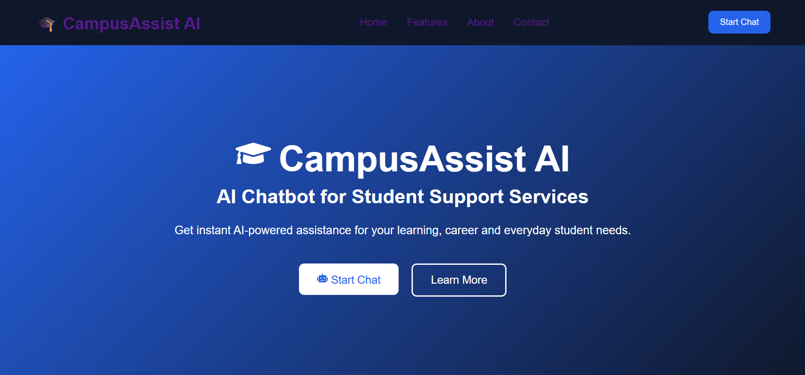
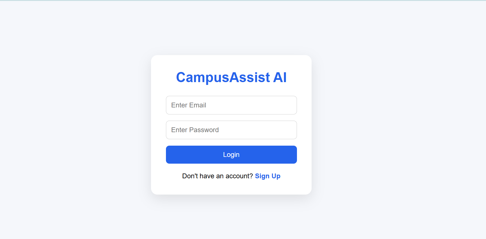
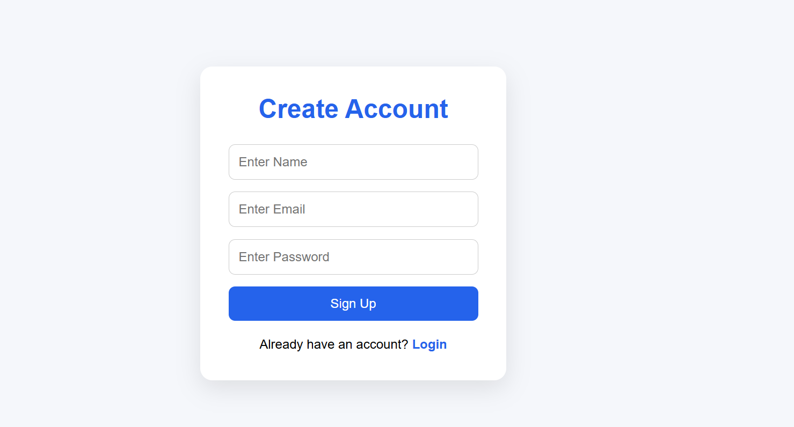
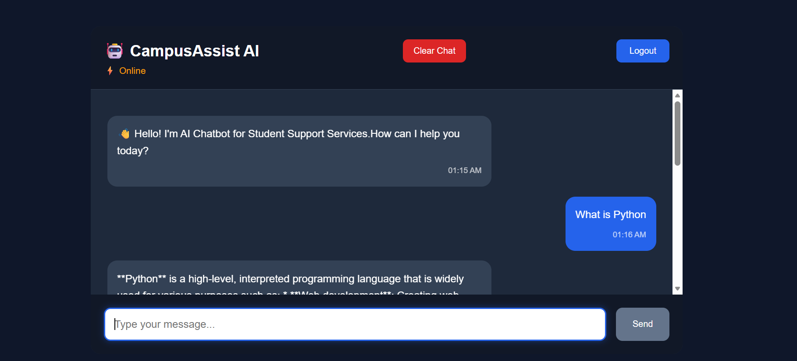

# 🎓 AI Chatbot for Student Support Services

An AI-powered chatbot developed to assist students by providing quick, intelligent and interactive responses. The chatbot offers guidance, learning support, coding assistance and career-related help through an easy-to-use conversational interface.

---

## 📌 Features

- 🤖 AI-powered chatbot
- 🔐 User Signup & Login Authentication
- 🔒 Secure Password Hashing using bcrypt
- 💬 Interactive Chat Interface
- ⚡ Fast AI Responses using Groq API
- 🗄 SQLite Database Integration
- 🧹 Clear Chat Option
- 🚪 Logout Functionality
- 📱 Responsive User Interface

---

## 🛠 Tech Stack

### Frontend
- React.js
- React Router DOM
- CSS
- Vite

### Backend
- FastAPI
- Python
- Groq API
- bcrypt
- SQLite

### Database
- SQLite (campusassist.db)

---

## 📂 Project Structure

```
AI-Chatbot-for-Student-Support-Services
│
├── frontend
│   ├── src
│   ├── public
│   └── package.json
│
├── backend
│   ├── main.py
│   ├── database.py
│   ├── campusassist.db
│   ├── .env
│   └── requirements.txt
│
└── README.md
```

---

## ⚙ Installation

### Clone Repository

```
git clone <repository-url>
```

### Backend

```
cd backend
```

Create Virtual Environment

```
python -m venv venv
```

Activate

Windows

```
venv\Scripts\activate
```

Install Requirements

```
pip install -r requirements.txt
```

Run Backend

```
python -m uvicorn main:app --reload
```

---

### Frontend

```
cd frontend
npm install
npm run dev
```

---

## 🚀 Usage

1. Create an account using Signup.
2. Login securely.
3. Start chatting with the AI assistant.
4. Ask questions and receive intelligent responses.
5. Clear chat whenever required.
6. Logout securely.

---

## 🔐 Authentication

- User Registration
- Login Authentication
- Password Hashing using bcrypt

---

## 🤖 AI Model

The chatbot uses:

- Groq API
- Llama 3.3 70B Versatile

---

# 📸 Project Screenshots

## 🏠 Landing Page



---

## 🔐 Login Page



---

## 📝 Signup Page



---

## 💬 Chat Interface



---

## 👨‍💻 Developed By

Harsh Pratap Singh

---

## 📄 License

This project is developed for educational purposes.

## 📊 Flowchart

                    +----------------------+
                    |        User          |
                    +----------+-----------+
                               |
                               |
                        React Frontend
                               |
        +----------------------+---------------------+
        |                      |                     |
        |                      |                     |
     Login                 Signup                Chat
        |                      |                     |
        +----------------------+---------------------+
                               |
                               |
                       FastAPI Backend
                               |
            +------------------+------------------+
            |                                     |
            |                                     |
     SQLite Database                      Groq API
     (Users Data)                    (Llama 3.3 70B)
            |                                     |
            +------------------+------------------+
                               |
                               |
                       AI Generated Response
                               |
                               |
                             User